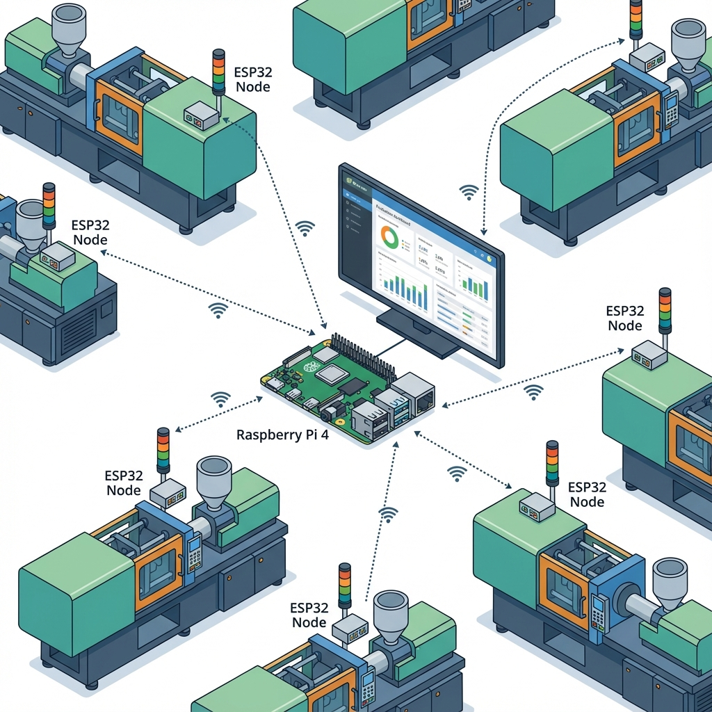
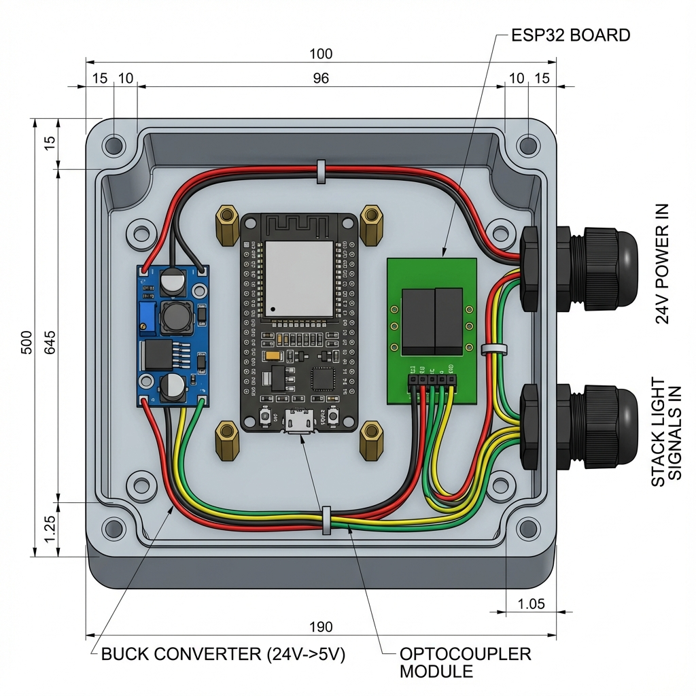
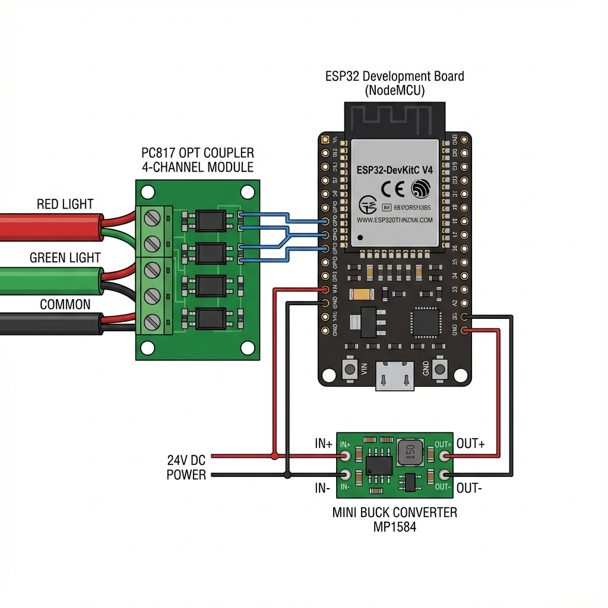
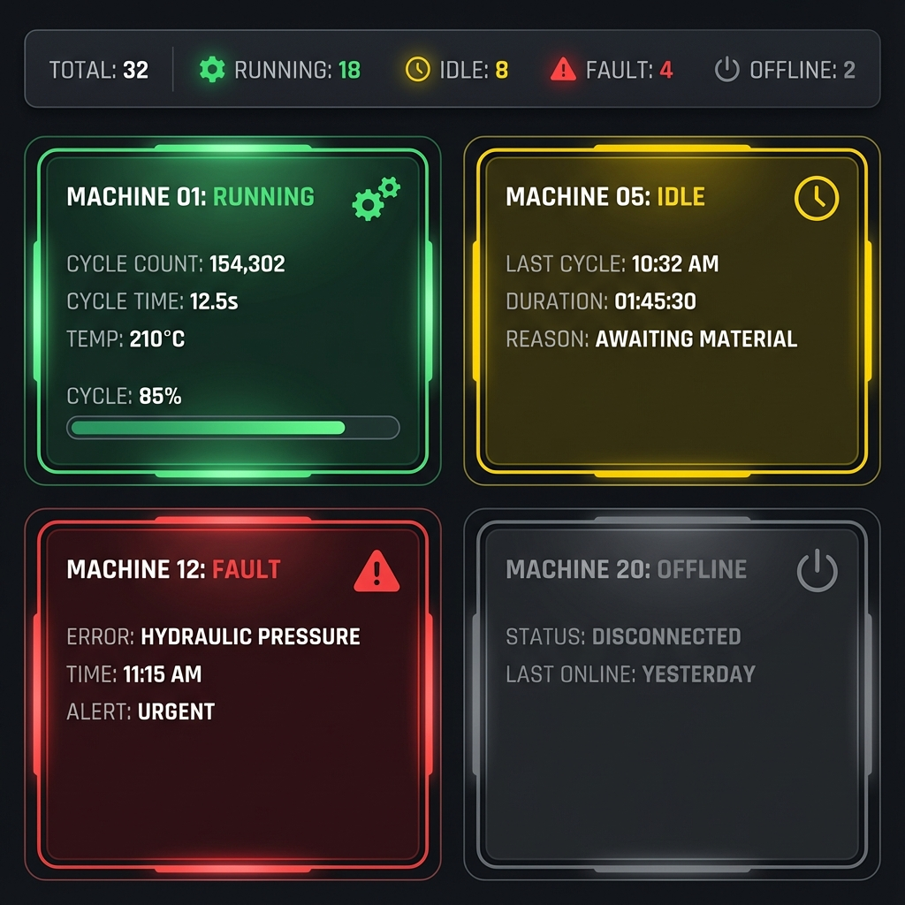

# Machine Status Dashboard - Implementation Plan V1

> **Modernized Stack**: Bun, Drizzle ORM, Hono, React + Vite

---

## Technology Stack

| Layer | Technology | Purpose |
|-------|-----------|---------|
| **Runtime** | Bun | Package manager, runtime, bundler |
| **Backend** | Hono | Ultrafast web framework |
| **ORM** | Drizzle | Type-safe database access |
| **Database** | SQLite (via better-sqlite3) | Local persistence |
| **Frontend** | React 19 + Vite | Modern SPA dashboard |
| **Styling** | Tailwind CSS v4 | Utility-first CSS |
| **UI Components** | Shadcn/ui | Accessible component library |
| **Data Fetching** | TanStack Query | Caching & real-time updates |
| **Validation** | Zod | Shared schema validation |
| **Real-time** | Server-Sent Events (SSE) | Live status updates |

---

## Phase 1: Bill of Materials

### System Architecture


### Per Machine (×18)



| Item | Qty | Unit Cost | Notes |
|------|-----|-----------|-------|
| ESP32-WROOM-32 dev board | 1 | $5-8 | NodeMCU-32S or similar |
| 4-channel optocoupler module (PC817) | 1 | $1-2 | Isolates 24V from ESP32 (Usually has built-in resistors) |
| 1kΩ resistors (Optional) | 3 | $0.10 | Only needed if module doesn't have them built-in |
| Small project enclosure | 1 | $3-5 | IP65 if near coolant/oil |
| 5V buck converter (mini) | 1 | $1-2 | MP1584 or similar, 24V→5V |
| Terminal blocks or Wago connectors | 1 set | $2 | Clean connections |
| Wire (22-24 AWG stranded) | ~3m | $1 | Signal runs to stack light |

**Per-machine cost: ~$15-25**

### Central System (×1)

| Item | Qty | Cost | Notes |
|------|-----|------|-------|
| Raspberry Pi 4 (2GB+) | 1 | $45-60 | Or any PC you have lying around |
| MicroSD card (32GB) | 1 | $8 | |
| 43-55" TV or monitor | 1 | $250-400 | Commercial preferred for brightness |
| WiFi access point (if needed) | 1 | $30-50 | Needs coverage across shop floor |

---

## Phase 2: Wiring Design

### Stack Light Basics

Your stack lights are almost certainly 24VDC. The tower typically has:
- **Common wire** (usually 24V+ or 0V, varies by manufacturer)
- **Individual wire per color** (red, yellow, green, sometimes blue/white)

Tap **green** (running) and **red** (fault). Yellow (idle) is inferred from absence of green.

### Wiring Diagram



> **Note on Resistors**: The diagram above shows a **Module** (green board). These usually have the 1kΩ resistors **built-in** (tiny black rectangles). If you buy the module, you don't need to add extra resistors. The text diagram below shows the logical connection.

#### The "Eyes vs. Food" Concept
*   **Top Path (Optocoupler) = The Eyes**: It watches the 24V light signals and tells the ESP32 what's happening. It keeps the dangerous 24V away from the ESP32.
*   **Bottom Path (Buck Converter) = The Food**: It takes 24V power and turns it into 5V to keep the ESP32 alive 24/7.

```
STACK LIGHT WIRING                         ESP32
─────────────────                         ──────

  24V Common ────────┬─────────────────────────────┐
                     │                             │
                     │    ┌──────────────────┐     │
  Green wire ────────┼───►│ 1kΩ    PC817    │     │
                     │    │  ┌─┐   ┌─────┐  │     │
                     │    └──┤R├───┤►│   ├──┼─────┼──► GPIO 34
                     │       └─┘   │ LED │  │     │
                     │             └─────┘  │     │
                     │                      │     │
  Red wire ──────────┼───►│ 1kΩ    PC817    │     │
                     │    │  ┌─┐   ┌─────┐  │     │
                     │    └──┤R├───┤►│   ├──┼─────┼──► GPIO 35
                     │       └─┘   │ LED │  │     │
                     │             └─────┘  │     │
  0V Common ─────────┴─────────────────────────────┴──► GND


  24V ──────► [Buck Converter 24V→5V] ──────► ESP32 VIN
  0V  ──────►                          ──────► ESP32 GND
```

### Key Points

1. **Find the common** - Use a multimeter to check if common-positive or common-negative
2. **Optocoupler wiring** - PC817: LED side (24V), transistor side (3.3V). 1kΩ limits to ~20mA
3. **ESP32 input pins** - GPIO 34, 35, 36, 39 (input-only). Enable pullups or use module's built-in

---

## Phase 3: ESP32 Firmware

```cpp
// machine_monitor.ino

#include <WiFi.h>
#include <HTTPClient.h>
#include <ArduinoJson.h>

// ============== CONFIGURATION ==============
const char* WIFI_SSID = "YourPlantWiFi";
const char* WIFI_PASSWORD = "YourPassword";
const char* SERVER_URL = "http://192.168.1.100:3000/api/status";

// Unique ID for this machine - change for each ESP32
const int MACHINE_ID = 1;
const char* MACHINE_NAME = "Haitian 1";

// Pin assignments
const int PIN_GREEN = 34;  // Running
const int PIN_RED = 35;    // Fault

// Timing
const unsigned long SEND_INTERVAL_MS = 5000;
const unsigned long CYCLE_DEBOUNCE_MS = 500;
const unsigned long WIFI_RETRY_INTERVAL = 30000;

// ============== STATE ==============
bool lastGreenState = false;
bool lastRedState = false;
unsigned long lastSendTime = 0;
unsigned long lastCycleTime = 0;
unsigned long cycleCount = 0;
bool wifiConnected = false;

void setup() {
  Serial.begin(115200);
  pinMode(PIN_GREEN, INPUT);
  pinMode(PIN_RED, INPUT);
  connectWiFi();
}

void connectWiFi() {
  Serial.printf("Connecting to %s...\n", WIFI_SSID);
  WiFi.begin(WIFI_SSID, WIFI_PASSWORD);
  
  int attempts = 0;
  while (WiFi.status() != WL_CONNECTED && attempts < 20) {
    delay(500);
    Serial.print(".");
    attempts++;
  }
  
  wifiConnected = (WiFi.status() == WL_CONNECTED);
  if (wifiConnected) {
    Serial.printf("\nConnected! IP: %s\n", WiFi.localIP().toString().c_str());
  } else {
    Serial.println("\nWiFi connection failed, will retry...");
  }
}

String getStatus(bool green, bool red) {
  if (red) return "fault";
  if (green) return "running";
  return "idle";
}

void sendStatus(bool green, bool red) {
  if (WiFi.status() != WL_CONNECTED) {
    wifiConnected = false;
    return;
  }
  
  HTTPClient http;
  http.begin(SERVER_URL);
  http.addHeader("Content-Type", "application/json");
  
  StaticJsonDocument<256> doc;
  doc["machineId"] = MACHINE_ID;
  doc["machineName"] = MACHINE_NAME;
  doc["status"] = getStatus(green, red);
  doc["green"] = green;
  doc["red"] = red;
  doc["cycleCount"] = cycleCount;
  doc["uptimeSec"] = millis() / 1000;
  
  String json;
  serializeJson(doc, json);
  
  int responseCode = http.POST(json);
  Serial.printf("Sent: %s (response: %d)\n", json.c_str(), responseCode);
  http.end();
}

void loop() {
  unsigned long now = millis();
  
  // Reconnect WiFi if needed
  if (!wifiConnected || WiFi.status() != WL_CONNECTED) {
    static unsigned long lastWifiRetry = 0;
    if (now - lastWifiRetry > WIFI_RETRY_INTERVAL) {
      lastWifiRetry = now;
      connectWiFi();
    }
  }
  
  // Read current state (inverted - optocoupler pulls low when active)
  bool greenOn = digitalRead(PIN_GREEN) == LOW;
  bool redOn = digitalRead(PIN_RED) == LOW;
  
  // Detect cycle completion (green turning ON after OFF)
  if (greenOn && !lastGreenState) {
    if (now - lastCycleTime > CYCLE_DEBOUNCE_MS) {
      cycleCount++;
      lastCycleTime = now;
      Serial.printf("Cycle detected! Total: %lu\n", cycleCount);
    }
  }
  
  // Send on state change OR periodic interval
  bool stateChanged = (greenOn != lastGreenState) || (redOn != lastRedState);
  bool timeToSend = (now - lastSendTime) >= SEND_INTERVAL_MS;
  
  if (stateChanged || timeToSend) {
    sendStatus(greenOn, redOn);
    lastSendTime = now;
  }
  
  lastGreenState = greenOn;
  lastRedState = redOn;
  delay(100);  // Poll at 10Hz
}
```

---

## Phase 4: Project Structure

```
molding-shop-status/
├── packages/
│   ├── api/                      # Hono backend
│   │   ├── src/
│   │   │   ├── db/
│   │   │   │   ├── schema.ts     # Drizzle schema
│   │   │   │   ├── index.ts      # DB connection
│   │   │   │   └── migrations/
│   │   │   ├── routes/
│   │   │   │   ├── machines.ts
│   │   │   │   └── status.ts
│   │   │   └── index.ts          # Hono app entry
│   │   ├── drizzle.config.ts
│   │   └── package.json
│   │
│   └── web/                      # React frontend
│       ├── src/
│       │   ├── components/
│       │   │   ├── MachineCard.tsx
│       │   │   ├── SummaryBar.tsx
│       │   │   └── Dashboard.tsx
│       │   ├── hooks/
│       │   │   └── useMachines.ts
│       │   ├── lib/
│       │   │   └── api.ts
│       │   ├── App.tsx
│       │   └── main.tsx
│       ├── index.html
│       └── package.json
│
├── firmware/                     # ESP32 Arduino code
│   └── machine_monitor/
│       └── machine_monitor.ino
│
├── package.json                  # Workspace root
├── bun.lockb
└── .env.example
```

---

## Phase 5: Database Schema (Drizzle ORM)

```typescript
// packages/api/src/db/schema.ts

import { sqliteTable, integer, text } from 'drizzle-orm/sqlite-core';
import { sql } from 'drizzle-orm';

export const machines = sqliteTable('machines', {
  machineId: integer('machine_id').primaryKey(),
  machineName: text('machine_name').notNull(),
  status: text('status', { 
    enum: ['running', 'idle', 'fault', 'offline'] 
  }).default('offline').notNull(),
  green: integer('green', { mode: 'boolean' }).default(false),
  red: integer('red', { mode: 'boolean' }).default(false),
  cycleCount: integer('cycle_count').default(0),
  
  // Production Order Details
  productionOrder: text('production_order'),
  partName: text('part_name'),
  targetCycleTime: real('target_cycle_time'), // seconds
  partsPerCycle: integer('parts_per_cycle').default(1),
  
  lastSeen: text('last_seen'),
  createdAt: text('created_at').default(sql`CURRENT_TIMESTAMP`),
});

export const statusLogs = sqliteTable('status_logs', {
  id: integer('id').primaryKey({ autoIncrement: true }),
  machineId: integer('machine_id')
    .references(() => machines.machineId)
    .notNull(),
  status: text('status').notNull(),
  cycleCount: integer('cycle_count'),
  timestamp: text('timestamp').default(sql`CURRENT_TIMESTAMP`),
});

// Type exports for use throughout the app
export type Machine = typeof machines.$inferSelect;
export type NewMachine = typeof machines.$inferInsert;
export type StatusLog = typeof statusLogs.$inferSelect;
```

```typescript
// packages/api/src/db/index.ts

import { drizzle } from 'drizzle-orm/bun-sqlite';
import { Database } from 'bun:sqlite';
import * as schema from './schema';

const sqlite = new Database('machine_status.db');
export const db = drizzle(sqlite, { schema });
```

---

## Phase 6: Backend API (Hono)

```typescript
// packages/api/src/index.ts

import { Hono } from 'hono';
import { cors } from 'hono/cors';
import { zValidator } from '@hono/zod-validator';
import { z } from 'zod';
import { eq, sql } from 'drizzle-orm';
import { db } from './db';
import { machines, statusLogs } from './db/schema';

const app = new Hono();

app.use('*', cors());

// Validation schema (shared with frontend via package)
const statusUpdateSchema = z.object({
  machineId: z.number(),
  machineName: z.string(),
  status: z.enum(['running', 'idle', 'fault', 'offline']),
  green: z.boolean(),
  red: z.boolean(),
  cycleCount: z.number(),
  uptimeSec: z.number().optional(),
});

// Update machine configuration (Manual Input)
const machineConfigSchema = z.object({
  machineId: z.number(),
  productionOrder: z.string().optional(),
  partName: z.string().optional(),
  targetCycleTime: z.number().optional(),
  partsPerCycle: z.number().default(1),
});

app.post('/api/machines/:id/config', zValidator('json', machineConfigSchema), async (c) => {
  const id = parseInt(c.req.param('id'));
  const data = c.req.valid('json');
  
  await db.update(machines)
    .set({
      productionOrder: data.productionOrder,
      partName: data.partName,
      targetCycleTime: data.targetCycleTime,
      partsPerCycle: data.partsPerCycle,
    })
    .where(eq(machines.machineId, id));
    
  return c.json({ success: true });
});

// Bulk update endpoint for the table view
app.post('/api/machines/bulk-update', zValidator('json', z.array(machineConfigSchema)), async (c) => {
  const updates = c.req.valid('json');
  
  // Run in transaction
  await db.transaction(async (tx) => {
    for (const update of updates) {
      await tx.update(machines)
        .set({
          productionOrder: update.productionOrder,
          partName: update.partName,
          targetCycleTime: update.targetCycleTime,
          partsPerCycle: update.partsPerCycle,
        })
        .where(eq(machines.machineId, update.machineId));
    }
  });
    
  return c.json({ success: true, count: updates.length });
});

// Receive status from ESP32
app.post('/api/status', zValidator('json', statusUpdateSchema), async (c) => {
  const data = c.req.valid('json');
  const now = new Date().toISOString();

  await db
    .insert(machines)
    .values({
      machineId: data.machineId,
      machineName: data.machineName,
      status: data.status,
      green: data.green,
      red: data.red,
      cycleCount: data.cycleCount,
      lastSeen: now,
    })
    .onConflictDoUpdate({
      target: machines.machineId,
      set: {
        machineName: data.machineName,
        status: data.status,
        green: data.green,
        red: data.red,
        cycleCount: data.cycleCount,
        lastSeen: now,
      },
    });

  // Log status
  await db.insert(statusLogs).values({
    machineId: data.machineId,
    status: data.status,
    cycleCount: data.cycleCount,
  });

  return c.json({ received: true });
});

// Get all machines
app.get('/api/machines', async (c) => {
  const allMachines = await db.select().from(machines).orderBy(machines.machineId);
  
  const now = Date.now();
  const result = allMachines.map((m) => {
    const lastSeenMs = m.lastSeen ? new Date(m.lastSeen).getTime() : null;
    const secondsSinceSeen = lastSeenMs ? Math.floor((now - lastSeenMs) / 1000) : null;
    
    return {
      ...m,
      status: secondsSinceSeen && secondsSinceSeen > 30 ? 'offline' : m.status,
      secondsSinceSeen,
    };
  });

  return c.json(result);
});

// Get summary counts
app.get('/api/summary', async (c) => {
  const allMachines = await db.select().from(machines);
  
  const now = Date.now();
  const statuses = allMachines.map((m) => {
    const lastSeenMs = m.lastSeen ? new Date(m.lastSeen).getTime() : null;
    const secondsSinceSeen = lastSeenMs ? Math.floor((now - lastSeenMs) / 1000) : null;
    return secondsSinceSeen && secondsSinceSeen > 30 ? 'offline' : m.status;
  });

  return c.json({
    total: allMachines.length,
    running: statuses.filter((s) => s === 'running').length,
    idle: statuses.filter((s) => s === 'idle').length,
    fault: statuses.filter((s) => s === 'fault').length,
    offline: statuses.filter((s) => s === 'offline').length,
    totalCycles: allMachines.reduce((sum, m) => sum + (m.cycleCount ?? 0), 0),
  });
});

// SSE endpoint for real-time updates
app.get('/api/events', async (c) => {
  return c.streamSSE(async (stream) => {
    while (true) {
      const allMachines = await db.select().from(machines);
      await stream.writeSSE({ data: JSON.stringify(allMachines) });
      await Bun.sleep(2000);
    }
  });
});

export default {
  port: 3000,
  fetch: app.fetch,
};
```

---

## Phase 7: Frontend (React + Vite)



### Setup

```bash
cd packages
bun create vite web --template react-ts
cd web
bun add @tanstack/react-query @tanstack/react-query-devtools @tanstack/react-table
bun add -D tailwindcss @tailwindcss/vite
```

### Main App

```tsx
// packages/web/src/App.tsx

import { QueryClient, QueryClientProvider, useQuery } from '@tanstack/react-query';
import { useState } from 'react';
import { MachineCard } from './components/MachineCard';
import { SummaryBar } from './components/SummaryBar';
import { MachineTable } from './components/MachineTable'; // New component
import { Button } from './components/ui/button'; // Shadcn UI

const queryClient = new QueryClient();

function Dashboard() {
  const [viewMode, setViewMode] = useState<'grid' | 'table'>('grid');
  
  const { data: machines = [] } = useQuery({
    queryKey: ['machines'],
    queryFn: () => fetch('/api/machines').then((r) => r.json()),
    refetchInterval: 2000,
  });

  const { data: summary } = useQuery({
    queryKey: ['summary'],
    queryFn: () => fetch('/api/summary').then((r) => r.json()),
    refetchInterval: 2000,
  });

  return (
    <div className="min-h-screen bg-slate-900 text-white p-6">
      <header className="flex justify-between items-center mb-6 pb-4 border-b border-slate-700">
        <h1 className="text-2xl font-semibold">Injection Molding - Machine Status</h1>
        
        <div className="flex gap-4 items-center">
            {summary && <SummaryBar summary={summary} />}
            <div className="flex bg-slate-800 rounded-lg p-1">
                <button 
                    onClick={() => setViewMode('grid')}
                    className={`px-3 py-1 rounded ${viewMode === 'grid' ? 'bg-blue-600' : 'hover:bg-slate-700'}`}
                >
                    Grid
                </button>
                <button 
                    onClick={() => setViewMode('table')}
                    className={`px-3 py-1 rounded ${viewMode === 'table' ? 'bg-blue-600' : 'hover:bg-slate-700'}`}
                >
                    Manage
                </button>
            </div>
        </div>
        
        <time className="text-slate-400 text-lg">
          {new Date().toLocaleTimeString('en-US', { hour: '2-digit', minute: '2-digit' })}
        </time>
      </header>

      {viewMode === 'grid' ? (
        <div className="grid grid-cols-[repeat(auto-fill,minmax(300px,1fr))] gap-4">
            {machines.map((machine) => (
            <MachineCard key={machine.machineId} machine={machine} />
            ))}
        </div>
      ) : (
        <MachineTable machines={machines} />
      )}
    </div>
  );
}

export default function App() {
  return (
    <QueryClientProvider client={queryClient}>
      <Dashboard />
    </QueryClientProvider>
  );
}
```

### Machine Card Component

```tsx
// packages/web/src/components/MachineCard.tsx

import { cn } from '../lib/utils';

interface Machine {
  machineId: number;
  machineName: string;
  status: 'running' | 'idle' | 'fault' | 'offline';
  cycleCount: number;
  secondsSinceSeen: number | null;
  productionOrder?: string;
  partName?: string;
  targetCycleTime?: number;
}

const statusStyles = {
  running: 'border-green-500 bg-gradient-to-br from-slate-800 to-green-950',
  idle: 'border-yellow-500 bg-gradient-to-br from-slate-800 to-yellow-950',
  fault: 'border-red-500 bg-gradient-to-br from-slate-800 to-red-950 animate-pulse',
  offline: 'border-slate-600 opacity-60',
};

const statusTextColors = {
  running: 'text-green-400',
  idle: 'text-yellow-400',
  fault: 'text-red-400',
  offline: 'text-slate-500',
};

function formatLastSeen(seconds: number | null): string {
  if (seconds === null) return 'Never';
  if (seconds < 10) return 'Just now';
  if (seconds < 60) return `${seconds}s ago`;
  if (seconds < 3600) return `${Math.floor(seconds / 60)}m ago`;
  return `${Math.floor(seconds / 3600)}h ago`;
}

export function MachineCard({ machine }: { machine: Machine }) {
  return (
    <div
      className={cn(
        'rounded-xl p-5 text-center border-2 transition-transform hover:-translate-y-0.5 hover:shadow-xl',
        statusStyles[machine.status]
      )}
    >
      <div className="flex justify-between items-start mb-4">
        <div>
          <h2 className="text-xl font-bold">{machine.machineName}</h2>
          <p className="text-sm opacity-80">{machine.productionOrder || 'No Order'}</p>
        </div>
        <div className={cn('px-2 py-1 rounded text-xs font-bold uppercase', statusTextColors[machine.status])}>
          {machine.status}
        </div>
      </div>
      
      <div className="space-y-2 text-left">
        <div className="flex justify-between">
          <span className="text-slate-400">Part:</span>
          <span className="font-medium">{machine.partName || '-'}</span>
        </div>
        <div className="flex justify-between">
          <span className="text-slate-400">Cycle Time:</span>
          <span>
            <span className="font-mono text-lg">{calculateAverageCycleTime(machine)}s</span>
            {machine.targetCycleTime && (
              <span className="text-xs text-slate-500 ml-1">/ {machine.targetCycleTime}s</span>
            )}
          </span>
        </div>
        <div className="flex justify-between">
          <span className="text-slate-400">OEE:</span>
          <span className={getOEEColor(machine)}>{calculateOEE(machine)}%</span>
        </div>
      </div>
      
      {/* Hidden 'Edit' button that appears on hover for supervisors */}
      <button className="absolute top-2 right-2 opacity-0 hover:opacity-100 p-1 bg-slate-700 rounded">
        ✏️
      </button>
    </div>
  );
}
```

### Summary Bar Component

```tsx
// packages/web/src/components/SummaryBar.tsx

interface Summary {
  running: number;
  idle: number;
  fault: number;
  offline: number;
}

export function SummaryBar({ summary }: { summary: Summary }) {
  return (
    <div className="flex gap-4 text-lg">
      <div className="px-4 py-2 rounded-lg bg-slate-800 border-l-4 border-green-500">
        <span className="font-bold">{summary.running}</span> Running
      </div>
      <div className="px-4 py-2 rounded-lg bg-slate-800 border-l-4 border-yellow-500">
        <span className="font-bold">{summary.idle}</span> Idle
      </div>
      <div className="px-4 py-2 rounded-lg bg-slate-800 border-l-4 border-red-500">
        <span className="font-bold">{summary.fault}</span> Fault
      </div>
      <div className="px-4 py-2 rounded-lg bg-slate-800 border-l-4 border-slate-500">
        <span className="font-bold">{summary.offline}</span> Offline
      </div>
    </div>
  );
}
```

---

## Phase 8: Development Setup

### Root package.json (Workspace)

```json
{
  "name": "molding-shop-status",
  "private": true,
  "workspaces": ["packages/*"],
  "scripts": {
    "dev": "bun run --filter '*' dev",
    "dev:api": "bun run --filter api dev",
    "dev:web": "bun run --filter web dev",
    "build": "bun run --filter '*' build",
    "db:generate": "bun run --filter api db:generate",
    "db:migrate": "bun run --filter api db:migrate"
  }
}
```

### API package.json

```json
{
  "name": "api",
  "scripts": {
    "dev": "bun --watch src/index.ts",
    "build": "bun build src/index.ts --outdir dist",
    "db:generate": "drizzle-kit generate",
    "db:migrate": "drizzle-kit migrate"
  },
  "dependencies": {
    "hono": "^4.0.0",
    "@hono/zod-validator": "^0.4.0",
    "drizzle-orm": "^0.35.0",
    "zod": "^3.23.0"
  },
  "devDependencies": {
    "drizzle-kit": "^0.26.0"
  }
}
```

### Environment Variables

```bash
# .env.example
DATABASE_URL=./machine_status.db
API_PORT=3000
VITE_API_URL=http://localhost:3000
```

---

## Phase 9: Raspberry Pi Deployment

```bash
# 1. Install Bun
curl -fsSL https://bun.sh/install | bash
source ~/.bashrc

# 2. Clone repository
git clone <your-repo-url> ~/machine-dashboard
cd ~/machine-dashboard

# 3. Install dependencies
bun install

# 4. Run database migrations
bun run db:migrate

# 5. Build for production
bun run build

# 6. Start server
bun run packages/api/dist/index.js
```

### Systemd Service

```ini
# /etc/systemd/system/machine-dashboard.service

[Unit]
Description=Machine Status Dashboard
After=network.target

[Service]
Type=simple
User=pi
WorkingDirectory=/home/pi/machine-dashboard
ExecStart=/home/pi/.bun/bin/bun run packages/api/dist/index.js
Restart=always
RestartSec=5
Environment=NODE_ENV=production

[Install]
WantedBy=multi-user.target
```

```bash
sudo systemctl enable machine-dashboard
sudo systemctl start machine-dashboard
```

---

## Phase 10: Installation Timeline

### Week 1: Pilot (2-3 machines)
1. Order parts for 3 machines + central system
2. Build and flash one ESP32 on bench with test LEDs
3. Set up Pi with Bun and verify server works
4. Pick 2-3 machines for pilot install
5. Trace stack light wiring, identify common and color wires
6. Install and validate real-time updates

### Week 2-3: Rollout
7. Order remaining parts
8. Build remaining ESP32 units (assembly line style)
9. Install in batches of 4-5 machines
10. Update `MACHINE_ID` and `MACHINE_NAME` for each unit before flashing

---

## Gotchas to Watch For

1. **Stack light polarity** - Check common-positive vs common-negative with a meter
2. **WiFi dead spots** - Walk the floor and verify signal coverage
3. **Power source** - Use USB power adapter if 24V isn't convenient
4. **Unique machine IDs** - Change `MACHINE_ID` when flashing each ESP32
5. **ESP32 input pins** - GPIO 34/35/36/39 lack internal pull-ups; verify optocoupler module has them
6. **SQLite write performance** - Enable WAL mode for better concurrent access
7. **Bun on ARM** - Bun supports ARM64 (Pi 4), but verify version compatibility

---

## Future Enhancements

- [ ] Historical charts (cycle count over time, uptime %)
- [ ] Email/SMS alerts for fault conditions
- [ ] Multiple dashboard views (by line, by machine type)
- [ ] OEE (Overall Equipment Effectiveness) calculations
- [ ] Authentication for admin features
- [ ] Docker deployment option
- [ ] Mobile-responsive design improvements
