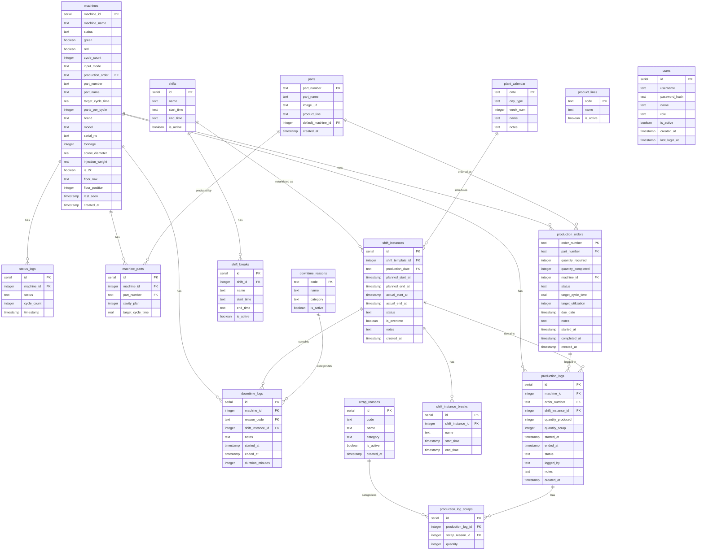

# Database Schema (ERD)

This document describes the database schema for the Molding Shop Status application.

## Entity Relationship Diagram

## Table Descriptions

| Table | Purpose |
|-------|---------|
| `machines` | Injection molding machines with specs and current status |
| `parts` | Part catalog with images and cycle times |
| `machine_parts` | Machine-to-part capability mappings |
| `production_orders` | Work orders for parts |
| `shifts` | Shift templates (Day, Swing, Night) |
| `shift_breaks` | Break times per shift template |
| `plant_calendar` | Working/non-working days |
| `shift_instances` | Actual shift occurrences per day |
| `shift_instance_breaks` | Actual breaks per shift instance |
| `production_logs` | Production entries per shift |
| `production_log_scraps` | Scrap by reason per log |
| `scrap_reasons` | Defect type lookup |
| `downtime_reasons` | Downtime category lookup |
| `downtime_logs` | Machine downtime events |
| `status_logs` | Historical machine status changes |
| `product_lines` | Product line categories |
| `users` | System users with roles |
